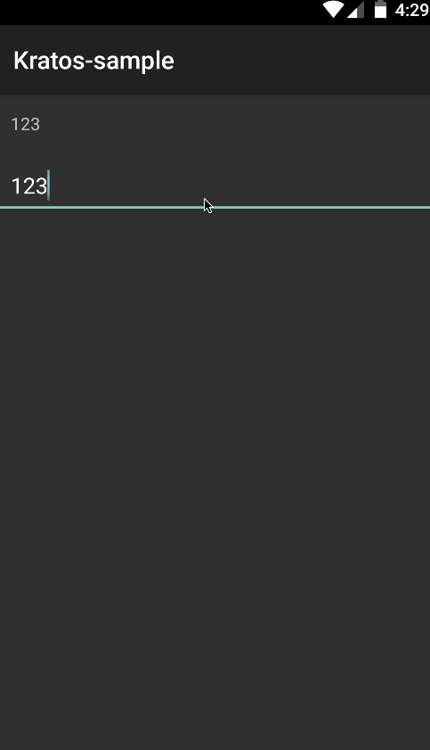
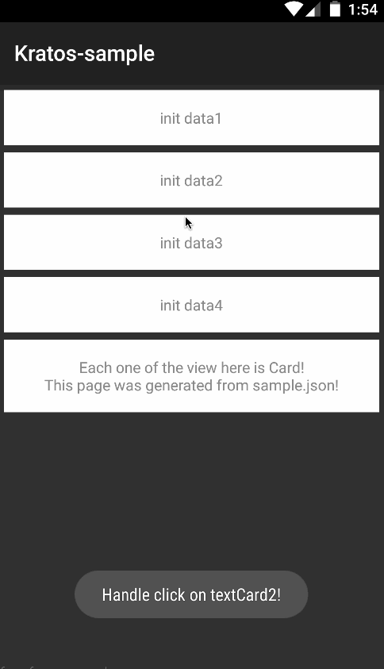
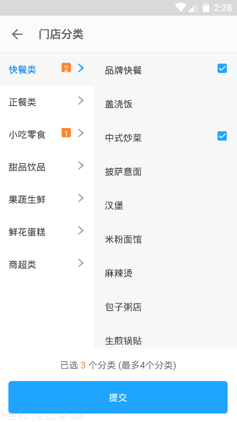
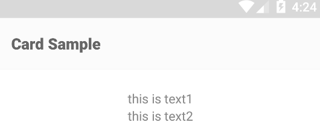
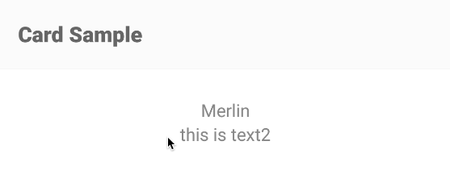

Kratos
=============


Provide basic __Double Binding(Data Binding)__ feature on Android.

* Using annotation to generate boilerplate code.
* Bind view and data to help you clean your code.


 Example
----------------

### Data Binding

The following code demostrate that two views(EditText and TextView) bound to one single data(which in the code `boundData` holds the data. you can later access or change the data by using `boundData.get()` and `boundData.set("some string")`)

```java
public class SimpleActivity extends Activity {

    @BindText({R.id.test_doublebinding_input, R.id.test_doublebinding_presenter})
    KString boundData = new KString();

    @Override
    protected void onCreate(Bundle savedInstanceState) {
        super.onCreate(savedInstanceState);
        setContentView(R.layout.activity_simple);
        Kratos.bind(this);
    }
}
```
The presenter(TextView) will behave exactly the same as input(EditText) since they were bound to the same data:



What if you want yourself a custom update behavior than the default update method when data changes? You can add custom update function to update view:

```java
@BindText(R.id.some_edittext_id)
KString boundData = new KString(new KString.Update() {
    @Override
    public void update(@NotNull View view, @NotNull String s) {
        EditText et = (EditText)view;          //Add custom update function here.
        int start = et.getSelectionStart();    // This code is the same as: public KString boundData1 = new KString(),
        et.setText(s);                         // since this custom function is the same as the default function.
        et.setSelection(start);
    }
});
```
If you are using Kotlin, the code is more simple:

```java
@KBindText("some_edittext_id")
public var boundData = KString {
    it, new ->
    it as EditText
    val position = this.selectionStart
    this.setText(new)
    this.setSelection(position)
}
```

### Card

__The concept of Card is very important in Kratos.__

Basically, every view is a card, each activity is generated by one single json file, a little bit like html. 

The goal is to implement each view as a card,
and then easily reuse them by manipulating json file.

For example, the following activity is generated from [`sample.json`][4] file. 



You can easily handle click event by override `onEventMainThread` method.

#### Notice that

* Kratos uses toolbar by default, so you need a `NoActionBar` theme in your style file, or you can just use `KratosTheme`.
* When you run into non-final id problem in your library project, just use annotation start with "L", for example `LBindText`. But remember that you should never use both kind of annotation in the same file!

#### What's the benefit

* No more fear of the changing requirements. Since activities are generated from json file, you can manipulate the layout on the fly(imagine put the json file on a server, like html on website).
* No more redundant code. Since each view is a card, you can reuse views easily by manipulate the json file.
* Easily create and compose custom views. All you need to do is to extend KCard, create you own KData and bind the data to the card(must write full package name, so that kratos can find your card). You can implement rather complex card using kratos depending on your skills. For example, all the view in the following activity are card: 



For more code see kratos-sample.

How To
-----------------

### Create custom card

To Create a card consists of two TextView that can also handle click even2

1. Create a class that extends KData, for example:

   ```java
   public class KText extends KData {
       public KString text1;
       public KString text2;
   }
   ```
2. Create a class that extends KCard, use KData as its Generic, for example:

	```java
	@BindLayout(R.layout.kcard_text)  //@LBindLayout("kcard_text")
	@Binds({@Bind(id = R.id.kcard_text_text1, data = "text1"),
	        @Bind(id = R.id.kcard_text_text2, data = "text2")})
	public class TextCard extends KCard<KText> {
	    public TextCard(@NotNull Context context) {
           super(context);
       }

       @Override
       public void init() {
           setOnLinkListener();
       }
	}
	```
   
   You should initailize your stuff inside `init` function, not constructor;
   
   Notice that it uses `BindLayout` to specify its layout:
   
   ```xml
   <?xml version="1.0" encoding="utf-8"?>
   <LinearLayout xmlns:android="http://schemas.android.com/apk/res/android"
       android:layout_width="match_parent"
       android:layout_height="wrap_content"
       android:background="#ffffff"
       android:gravity="center_horizontal"
       android:orientation="vertical"
       android:padding="16dp">

       <TextView
           android:id="@+id/kcard_text_text1"
           android:layout_width="wrap_content"
           android:layout_height="wrap_content"
           android:gravity="center"
           android:textColor="#888888"
           android:textSize="14sp" />
       <TextView
           android:id="@+id/kcard_text_text2"
           android:layout_width="wrap_content"
           android:layout_height="wrap_content"
           android:gravity="center"
           android:textColor="#888888"
           android:textSize="14sp" />
   </LinearLayout>
   ```
   
3. Create a Activity that extends KCardActivity:
   
	```java
	public class CardSampleActivity extends KCardActivity {
	
	    private void showToast(String text) {
	        Toast.makeText(CardSampleActivity.this, text, Toast.LENGTH_SHORT).show();
	    }
	
	    @Override
	    public void onEventMainThread(@NotNull KOnClickEvent<KData> event) {
	        super.onEventMainThread(event);
	        switch (event.id) {
	            case "textCard1":
	                showToast("Handle click on textCard1!");
	                break;
	        }
	    }
	}
	```
	Notice that it handles click event by overriding o`nEventMainThread` method.

4. Pass your json layout to your activity:
   
	```json
	{
	  "header": {
	    "title": "Card Sample"
	  },
	  "body": [
	    {
	      "data": {
	        "text": "this is text1",
	        "text": "this is text2"
	      },
	      "type": "me.ele.kratos_sample.TextCard",
	      "id": "textCard1",
	      "style": {
	        "margin_top": 20,
	        "margin_left": 20,
	        "margin_right": 20
	      }
	    }
	  ]
	}  
	```
	Notice that it uses full package name in `type` property.
	
	You can use kratos' util function to pass json file to your next activity:
	
	```java
	ActivityUtils.jump(SimpleActivity.this, CardSampleActivity.class, CODE_CARD_SAMPLE, R.raw.sample);
	```
	
5. Create a package-info.java file in your source folder like this:

    ```java
    @PackageName package me.ele.kratos_sample;
    
    import kratos.PackageName;
    ```

You will get something like this:



### Add Custom updater:

If you want a custom update behavior when data been changed, add a function annotated with `OnKStringChanged` to your card, like this:

```java
@OnKStringChanged("text1")
public void updateText1(@NotNull TextView v, @NotNull String s) {
    v.setText(s);
    Log.d("TextCard", "custom updater!");
}
```

### Wait

*You may say:"That's no big deal. what's the point?"*

*But*

This is where the magic happens!
-----------------

Assume you have this data object which implements `Parcelable`:

```java
public class Customer implements Parcelable {

    public KString name = new KString();

    @Override
    public int describeContents() {
        return 0;
    }

    @Override
    public void writeToParcel(Parcel dest, int flags) {
        dest.writeParcelable(this.name, flags);
    }

    public Customer() {
    }

    protected Customer(Parcel in) {
        this.name = in.readParcelable(KString.class.getClassLoader());
    }

    public static final Creator<Customer> CREATOR = new Creator<Customer>() {
        public Customer createFromParcel(Parcel source) {
            return new Customer(source);
        }

        public Customer[] newArray(int size) {
            return new Customer[size];
        }
    };
}
```
This Customer has a property -- name, and this is what you do.

1. Change the `text1` element in the json file above to this:

```json
"text1": "{Customer.name}",
```

2. Add this code to your activity:

```java
Customer customer;
@Override
public void onFinishRender() {
    bind(this, customer);
}
```
Tada!!From now on, if you want to change the view that has Customer's name in it, all you need to do is change the value of `customer.name`, say you do this:
 
 ```java
 customer.name.set("Merlin");
 ``` 
 This is what you get:
 
 
 
 Dude, Holy ****, This is Magic..
 

Download
-----------------
__Kratos is still under development and a lot of features haven't been added to it yet.__ But the basic idea is here. If you are interested in this project, feel free to fork.

Kratos is available from maven central:

```groovy
apply plugin: 'com.neenbedankt.android-apt'
buildscript {
    ext.kratos_version = '0.2.2'
    repositories {
        mavenCentral()
    }
    dependencies {
        classpath 'com.neenbedankt.gradle.plugins:android-apt:1.8'
    }
}

dependencies {
    compile "com.github.acemerlin:kratos:$kratos_version"
    apt "com.github.acemerlin:kratos-compiler:$kratos_version"
}
```

How It Works
----------------
* Use Kotlin's [Observable Delegate][1] to listen to changes made to certain property.
* Use Kotlin's [Extension][2] feature to add functions to View.
* Use Annotation Processor to generate code which binds the data and the view(or views).


Lisence
----------------
[GNU GENERAL PUBLIC LICENSE Version 3][3]

[1]: https://kotlinlang.org/docs/reference/delegated-properties.html#observable
[2]: https://kotlinlang.org/docs/reference/extensions.html
[3]: http://www.gnu.org/licenses/gpl-3.0.en.html
[4]: https://github.com/ACEMerlin/Kratos/blob/feature/card/kratos-sample/src/main/res/raw/sample.json