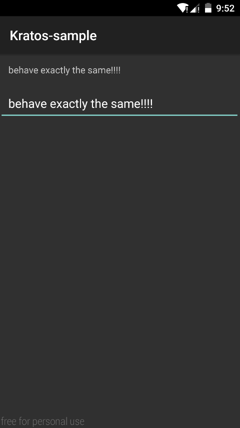

Kratos
=============


Provide basic __Double Binding(Data Binding)__ feature on Android.

* Using annotation to generate boilerplate code.
* Bind view and data to help you clean your code.


 Example
----------------
The following code demostrate that two views(EditText and TextView) bound to one single data(which in the code `boundData` holds the data. you can later access or change the data by using `boundDate.data`)

```java
public class SimpleActivity extends Activity {

    @BindText({R.id.test_doublebinding_input, R.id.test_doublebinding_presenter})
    KString boundData = new KString();

    @Override
    protected void onCreate(Bundle savedInstanceState) {
        super.onCreate(savedInstanceState);
        setContentView(R.layout.activity_simple);
        Kratos.bind(this);
    }
}
```
The presenter(TextView) will behave exactly the same as input(EditText) since they were bound to the same data:



For more code see kratos-sample.


Download
-----------------
__Kratos is still under development and a lot of features haven't been added to it yet.__ But the basic idea is here. If you are interested in this project, feel free to fork.

Kratos is currently not available from maven central. 